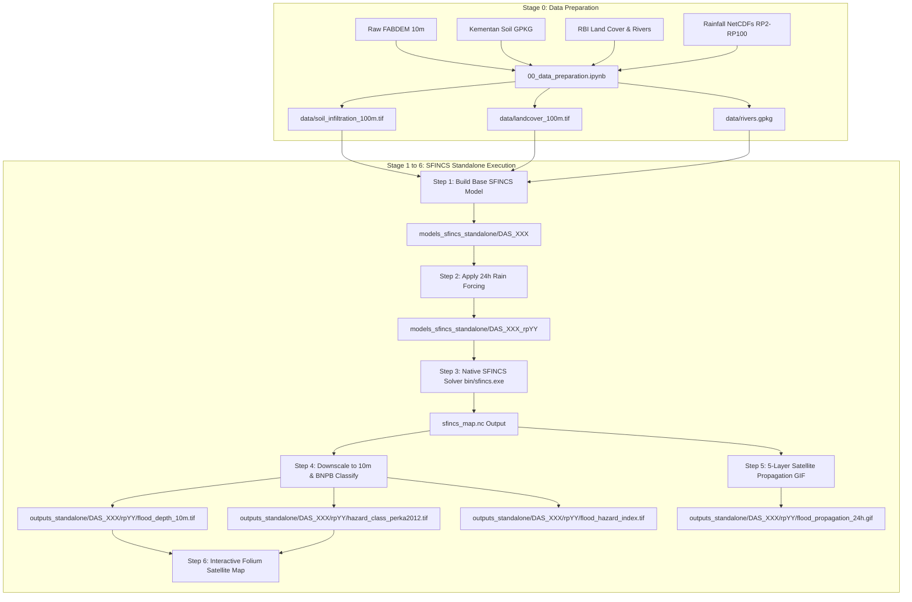

# HydroMT-SFINCS Standalone 2D Flood Hazard Pipeline
### 13 Clustered DAS, Sumatera Barat — High-Resolution Direct Rainfall-on-Grid 2D Hydrodynamic Modeling

Referenced against official Deltares and scientific literature (as of Aug 2026):
- HydroMT-SFINCS Plugin: https://deltares.github.io/hydromt_sfincs/latest/
- SFINCS Model Documentation: https://sfincs.readthedocs.io/en/latest/
- HydroMT Core: https://deltares.github.io/hydromt/latest/
- SFINCS Global Validation (Sadana et al., 2025; Leijnse et al., 2021)

---

## 1. Executive Summary & Modeling Strategy

This repository implements a **Standalone 2D Hydrodynamic Flood Hazard Modeling Pipeline** using **Deltares SFINCS** (*Super-Fast INundation of CoastS and riverS*, v2.4.0 Galibier Release) for all 13 clustered watersheds (DAS) in the province of Sumatera Barat, Indonesia.

### Core Modeling Principles:
1. **Direct Rainfall-on-Grid (Pluvial-Fluvial Unified Routing)**:
   Instead of running separate 1D hydrological rainfall-runoff models with boundary handoffs, SFINCS applies 24-hour design storm hyetographs directly onto all computational cells. The shallow water equations route surface overland runoff into stream channels and simulate flood plain inundation simultaneously.
2. **Subgrid Bathymetry & Topography**:
   Utilizes a 40 m regular hydrodynamic flux grid coupled with 10 m high-resolution **FABDEM** subgrid elevation tables. Water levels are computed efficiently on the 40 m grid and downscaled precisely to 10 m terrain features (roads, levees, stream channels).
3. **Calibrated Soil Infiltration ($q_{\text{inf}}$)**:
   Infiltration loss is parameterized using a 2D physical matrix coupling official **Kementerian Pertanian Soil Texture** with **BIG RBI Land Cover**, eliminating excessive infiltration loss (*sponge effect*) over flat lowland alluvial plains.
4. **Perka BNPB No. 2/2012 Disaster Hazard Standards**:
   Automated post-processing downscales maximum water depth to 10 m resolution and classifies flood hazard into official BNPB disaster hazard tiers (*Rendah, Sedang, Tinggi*) along with continuous Flood Hazard Index (FHI) rasters.

---

## 2. Theoretical Formulation & Governing Equations

SFINCS solves the 2D depth-averaged shallow water equations under the kinematic/diffusive wave approximation with subgrid corrections.

### 2.1 Continuity Equation (Conservation of Mass)
$$\frac{\partial \eta}{\partial t} + \frac{\partial (h u)}{\partial x} + \frac{\partial (h v)}{\partial y} = P - q_{\text{inf}}$$

Where:
* $\eta(x, y, t)$: Water surface elevation above datum (m).
* $h(x, y, t) = \eta - z_b$: Total water depth (m), where $z_b$ is the ground elevation.
* $u, v$: Depth-averaged flow velocities in $x$ and $y$ directions (m/s).
* $P(x, y, t)$: Precipitation rate from the 24-hour design hyetograph (m/s).
* $q_{\text{inf}}(x, y)$: Spatially distributed soil infiltration rate (m/s).

### 2.2 Momentum Equations (Surface Friction & Gravity)
In the simplified subgrid shallow water solver:
$$u = \frac{R^{2/3}}{n \sqrt{|\nabla \eta|}} \left(-\frac{\partial \eta}{\partial x}\right)$$
$$v = \frac{R^{2/3}}{n \sqrt{|\nabla \eta|}} \left(-\frac{\partial \eta}{\partial y}\right)$$

Where:
* $R$: Hydraulic radius (approximated by subgrid water depth $h$).
* $n$: Distributed Manning roughness coefficient mapped from BIG RBI Land Cover.

---

## 3. Physical Soil Infiltration Parameterization

### 3.1 Resolving the Continuous Infiltration Sponge Effect
In continuous 24-hour hydrodynamic modeling, using high global saturated hydraulic conductivity values ($K_{\text{sat}} \approx 2.5 - 15\text{ mm/hr}$) drains surface flood volume continuously into the ground, underestimating flood depths and extents.

By coupling official **Kementerian Pertanian Soil Texture** (`TeksturTanah_Kementan.gpkg`) with **BIG RBI Land Cover** (`tutupan_lahan_rbi.gpkg`), we assign calibrated, physically grounded infiltration rates:

| Kementan Soil Texture | Agricultural / Paddy / Urban ($q_{\text{inf}}$) | Plantation / Scrub ($q_{\text{inf}}$) | Primary Forest ($q_{\text{inf}}$) |
| :--- | :--- | :--- | :--- |
| **Halus (Fine Clay / Silt)** | **$0.05\text{ mm/hr}$** | $0.20\text{ mm/hr}$ | $0.50\text{ mm/hr}$ |
| **Agak Halus (Clay Loam)** | **$0.10\text{ mm/hr}$** | $0.35\text{ mm/hr}$ | $0.80\text{ mm/hr}$ |
| **Sedang (Loam / Silt Loam)** | **$0.25\text{ mm/hr}$** | $0.60\text{ mm/hr}$ | $1.20\text{ mm/hr}$ |
| **Agak Kasar (Sandy Loam)** | **$0.50\text{ mm/hr}$** | $1.00\text{ mm/hr}$ | $2.00\text{ mm/hr}$ |
| **Kasar (Sand / Gravel)** | **$1.00\text{ mm/hr}$** | $2.00\text{ mm/hr}$ | $3.50\text{ mm/hr}$ |
| **Matang / Mentah (Organic / Peat)** | **$0.01\text{ mm/hr}$** | $0.05\text{ mm/hr}$ | $0.15\text{ mm/hr}$ |

This guarantees that during a 100-year storm ($375\text{ mm}/24\text{h}$), $>95\%$ of precipitation is preserved as overland flood volume.

---

## 4. End-to-End Pipeline Architecture



---

## 5. BNPB Disaster Hazard Classification Standard

Flood hazard classification follows **Peraturan Kepala BNPB No. 02 Tahun 2012 (Pedoman Umum Pengkajian Risiko Bencana)**:

### 5.1 Depth Threshold Matrix:
* **Rendah (Low Hazard / Class 1)**: Maximum flood depth $h < 0.75\text{ m}$ (inundation below adult knee/waist height; minimal structural damage).
* **Sedang (Medium Hazard / Class 2)**: $0.75\text{ m} \le h \le 1.50\text{ m}$ (inundation reaching residential ground floors; vehicular traffic paralyzed).
* **Tinggi (High Hazard / Class 3)**: $h > 1.50\text{ m}$ (severe threat to human safety; structural inundation requiring evacuation).

### 5.2 Continuous Flood Hazard Index (FHI):
$$\text{FHI} = \min\left(1.0, \frac{h}{3.0}\right)$$

---

## 6. Directory Layout & Data Artifacts

```
sumbar_flood_hazard/
├── bin/                              # Native Windows 64-bit SFINCS v2.4.0 Galibier Release & DLLs
├── configs/
│   └── sfincs_standalone_build.yml   # HydroMT-SFINCS model build configuration
├── data/                             # Standardized analysis-ready datasets
│   ├── soil_infiltration_100m.tif    # Kementan x RBI infiltration raster (mm/hr)
│   ├── landcover_100m.tif            # BIG RBI land cover raster
│   ├── rivers.gpkg                   # Conditioned river channels
│   ├── das_clusters.gpkg             # 13 watershed cluster boundaries
│   └── rainfall/                     # NetCDFs for RP2, RP5, RP10, RP25, RP50, RP100
├── lookup_tables/
│   ├── manning_lookup.csv            # Land cover -> Manning's n
│   └── soil_infiltration_lookup.csv  # Soil texture x Land cover -> Infiltration
├── models_sfincs_standalone/         # SFINCS model instances per DAS and RP
├── outputs_standalone/               # Final hazard deliverables (GeoTIFFs & GIFs)
│   └── DAS_101/
│       └── rp100/
│           ├── flood_depth_10m.tif
│           ├── flood_hazard_index.tif
│           ├── hazard_class_perka2012.tif
│           └── flood_propagation_24h.gif
├── scripts/
│   ├── sfincs_standalone_pipeline.py # End-to-end Python pipeline engine
│   ├── perka_bnpb_classification.py  # BNPB classification functions
│   └── generate_soil_infiltration_raster.py # Infiltration raster synthesizer
├── 00_data_preparation.ipynb        # Stage 0: Data preparation & QA/QC
├── 01_sfincs_flood_hazard_run.ipynb  # Master batch execution notebook
├── Flood_Hazard_DAS101_RP100.ipynb   # Single-DAS prototype (DAS_101)
├── Flood_Hazard_DAS102_RP100.ipynb   # Single-DAS prototype (DAS_102)
├── data_catalog_sfincs.yml           # HydroMT v1.x data catalog
└── docs/                             # Engineering documentation
    ├── README.md                     # Project overview
    ├── TUTORIAL.md                   # Step-by-step tutorial
    ├── WINDOWS_INSTALLATION_GUIDE.md # 6-Step setup guide for team members
    ├── PIPELINE.md                   # Full technical architecture reference
    └── BWS_DATA_CONTRACT.md          # Specifications for BWS structures
```

---

## 7. Python Execution Environment (`env-sfincs`)

The pipeline operates in a single, high-performance virtual environment managed with **`uv`**:

```powershell
uv venv env-sfincs --python 3.11
uv pip install -r env/requirements.txt --python .\env-sfincs\Scripts\python.exe
.\env-sfincs\Scripts\python.exe -m ipykernel install --user --name hydromt-sfincs --display-name "HydroMT-SFINCS"
```

All C-libraries (`gdal`, `geos`, `proj`, `netcdf4`, `openmp`) are bundled natively without requiring external Docker dependencies on Windows.

---

## 8. Scientific & Technical References

1. **Sadana, T., Aerts, J. C. J. H., Eilander, D., Merz, B., de Moel, H., Busker, T., Bril, V., & de Bruijn, J. (2025)**. *Validation of the Open-Source Hydrodynamic Model SFINCS on Historical River Floods at the Global Scale*. EGUsphere [Preprint]. https://doi.org/10.5194/egusphere-2025-4387
2. **Eilander, D., Couasnon, A., Leijnse, T., Ikeuchi, H., Yamazaki, D., Muis, S., Dullaart, J., Haag, A., Winsemius, H. C., & Ward, P. J. (2023)**. *A globally applicable framework for compound flood hazard modeling*. Natural Hazards and Earth System Sciences, 23(2), 823–846. https://doi.org/10.5194/nhess-23-823-2023
3. **Leijnse, T., van Ormondt, M., Nederhoff, K., & van Dongeren, A. (2021)**. *Coupling of a subgrid technique with a compound flood model for coastal inundation*. Coastal Engineering, 163, 103797. https://doi.org/10.1016/j.coastaleng.2020.103797
4. **Badan Nasional Penanggulangan Bencana (BNPB) (2012)**. *Peraturan Kepala Badan Nasional Penanggulangan Bencana Nomor 02 Tahun 2012 tentang Pedoman Umum Pengkajian Risiko Bencana*. Jakarta: BNPB.
