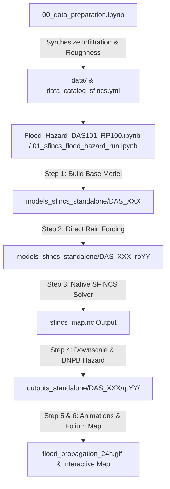

# TUTORIAL — Running Standalone HydroMT-SFINCS Flood Modeling

This tutorial guides you step-by-step through executing the complete **Standalone HydroMT-SFINCS 2D Flood Hazard Modeling Pipeline** for the 13 watershed clusters (DAS) in Sumatera Barat.

---

## Workflow Overview



---

## Step 1 — Verify Prepared Datasets

Ensure the following core datasets are available in `data/`:

| Path | Data Type | Description |
|---|---|---|
| `data/soil_infiltration_100m.tif` | Raster (100m) | Physical infiltration rates derived from Kementan $\times$ RBI ($q_{\text{inf}}$ in mm/hr) |
| `data/landcover_100m.tif` | Raster (100m) | BIG RBI Land Cover used for Manning's $n$ mapping |
| `data/rivers.gpkg` | Vector (LineString) | BIG RBI river network in `EPSG:32747` |
| `data/das_clusters.gpkg` | Vector (Polygon) | 13 clustered watershed boundaries (`DAS_101` to `DAS_113`) |
| `data/boundary_kabkot.gpkg` | Vector (Polygon) | Administrative boundaries for map overlays |
| `data/boundary_kecamatan.gpkg`| Vector (Polygon) | Subdistrict boundaries for detailed overlays |
| `data/rainfall/` | NetCDF (`.nc`) | 24-hour design storm hyetographs for 6 return periods (RP2 to RP100) |

If you need to regenerate the base raster layers, run [`00_data_preparation.ipynb`](../00_data_preparation.ipynb) top-to-bottom.

---

## Step 2 — Activate the Python Environment

Open PowerShell in the repository root:
```powershell
.\env-sfincs\Scripts\activate
```

Verify that the environment has `hydromt_sfincs`, `rioxarray`, `geopandas`, and `contextily` installed:
```powershell
python -c "import hydromt_sfincs, geopandas, rioxarray; print('Environment is ready!')"
```

---

## Step 3 — Run a Single-DAS Prototype

To inspect a single basin cluster (e.g. `DAS_101` for the 100-Year Return Period `rp100`):

1. Open [`Flood_Hazard_DAS101_RP100.ipynb`](../Flood_Hazard_DAS101_RP100.ipynb) (or [`Flood_Hazard_DAS102_RP100.ipynb`](../Flood_Hazard_DAS102_RP100.ipynb)).
2. Select the **`env-sfincs`** Python kernel.
3. Run the cells in sequence:
   * **Cell 1 (Environment Setup & Auto-Reload)**: Sets PROJ/GDAL directories and imports `sfincs_standalone_pipeline`.
   * **Cell 2 (Step 1 Base Model Build)**: Creates subgrid elevation tables from 10m FABDEM and sets up Kementan soil infiltration.
   * **Cell 3 (Step 2 Rainfall Forcing)**: Applies the 24h design hyetograph to the model.
   * **Cell 4 (Step 3 SFINCS 2D Simulation)**: Launches the native multi-threaded `sfincs.exe` engine with a live progress bar.
   * **Cell 5 (Step 4 Post-Processing & BNPB Classification)**: Downscales maximum flood depth to 10m subgrid resolution, computes the continuous Flood Hazard Index (FHI), and classifies hazard levels (Rendah, Sedang, Tinggi) per Perka BNPB No. 2/2012.
   * **Cell 6 (Step 5 Flood Propagation Animation)**: Renders a 5-layer animated satellite GIF (`flood_propagation_24h.gif`).
   * **Cell 7 (Step 6 Interactive Map)**: Displays an interactive Folium map with satellite basemap toggle.

---

## Step 4 — Master Batch Production (13 DAS $\times$ 6 Return Periods)

To process all 13 watersheds across all 6 return periods (78 total model runs):

1. Open [`01_sfincs_flood_hazard_run.ipynb`](../01_sfincs_flood_hazard_run.ipynb).
2. Configure your target clusters and return periods:
   ```python
   SELECTED_CLUSTERS = ["DAS_101", "DAS_102", "DAS_103", ..., "DAS_113"]
   SELECTED_RPS = ["rp2", "rp5", "rp10", "rp25", "rp50", "rp100"]
   ```
3. Run the batch loop. The automated pipeline handles chip caching, simulation execution, downscaling, and output raster export.

---

## Step 5 — Output File Inspection

All model outputs are saved in `outputs_standalone/{das_id}/{rp}/`:

```
outputs_standalone/DAS_101/rp100/
├── flood_depth_10m.tif            # Downscaled maximum inundation depth (m)
├── flood_hazard_index.tif         # Continuous Flood Hazard Index (0.0 to 1.0)
├── hazard_class_perka2012.tif      # BNPB Hazard Classes (1: Rendah, 2: Sedang, 3: Tinggi)
└── flood_propagation_24h.gif      # 5-Layer animated satellite GIF
```

Open these GeoTIFFs in QGIS or ArcGIS Pro with the Perka BNPB color ramp (Yellow: Rendah, Orange: Sedang, Red: Tinggi) for cartographic reporting.

