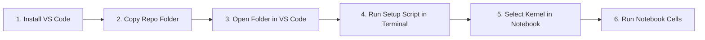

# Windows Setup & Installation Guide (Beginner-Friendly)
## Quick 6-Step Setup for Team Members to Run Standalone HydroMT-SFINCS on Windows

This guide provides the simplest, foolproof workflow for team members to run the **Sumatera Barat 2D Flood Hazard Model** on their Windows PCs without needing Git, Conda, or administrator privileges.

---

## ⚡ The 6-Step Quick Workflow (No Git Required)



### 1️⃣ Step 1: Install Visual Studio Code
* Download and install **VS Code** from [https://code.visualstudio.com/](https://code.visualstudio.com/).
* Open VS Code, go to the Extensions tab (`Ctrl + Shift + X`), search and install:
  * **Python** (by Microsoft)
  * **Jupyter** (by Microsoft)

### 2️⃣ Step 2: Copy the Project Folder to Local PC
* Copy the `sumbar_flood_hazard` folder (via flash drive, shared drive, or zip) onto your PC:
  * Example: `D:\Project\sumbar_flood_hazard` or `C:\Project\sumbar_flood_hazard`.
### 3️⃣ Step 3: Open the Folder in VS Code
* In VS Code: Click **File** $\rightarrow$ **Open Folder...** $\rightarrow$ Select `D:\Project\sumbar_flood_hazard`.

### 4️⃣ Step 4: Run the Automated Setup Script in VS Code Terminal
* Open the built-in terminal in VS Code (`Ctrl + ` ` ` or **Terminal** $\rightarrow$ **New Terminal**).
* Copy and paste this single command:
  ```powershell
  powershell -ExecutionPolicy Bypass -File .\env\setup_env.ps1
  ```
  *(This automatically installs `uv`, configures Python 3.11, installs all geospatial packages in under 60 seconds, and registers the Jupyter kernel).*

### 5️⃣ Step 5: Open Notebook and Select Kernel
* Open a master batch notebook in [`notebook/master/01_sfincs_flood_hazard_run.ipynb`](../notebook/master/01_sfincs_flood_hazard_run.ipynb) (or an individual cluster template in [`notebook/sumbar2026/Flood_Hazard_DAS101_RP100.ipynb`](../notebook/sumbar2026/Flood_Hazard_DAS101_RP100.ipynb)).
* In the top-right corner, click **Select Kernel** $\rightarrow$ choose **`HydroMT-SFINCS`**.

### 6️⃣ Step 6: Set Your Assigned Watershed & Run!
* In the configuration cell, set your assigned watershed:
  ```python
  SELECTED_CLUSTERS = ["DAS_103"]  # Change to your assigned DAS ID (DAS_101 to DAS_114)
  SELECTED_RPS = ["rp100"]
  ```
* Click **Run All** (or run cells step-by-step).


---

### Manual Setup (If you prefer running step-by-step):

If you prefer executing each command manually in PowerShell:

```powershell
# 1. Install astral-sh/uv package manager
powershell -ExecutionPolicy ByPass -c "irm https://astral.sh/uv/install.ps1 | iex"

# Refresh PATH in current terminal
$env:Path += ";$HOME\.local\bin;$HOME\.cargo\bin"

# 2. Create virtual environment with Python 3.11
uv venv env-sfincs --python 3.11

# 3. Install HydroMT-SFINCS and all geospatial dependencies
uv pip install -r env/requirements.txt --python .\env-sfincs\Scripts\python.exe

# 4. Register the Jupyter Kernel for VS Code
.\env-sfincs\Scripts\python.exe -m ipykernel install --user --name hydromt-sfincs --display-name "HydroMT-SFINCS"
```

---

## 🔍 Step 4 — Verify Native SFINCS Solver & DLLs

Verify that the native 64-bit SFINCS hydrodynamic executable runs properly:

```powershell
.\bin\sfincs.exe
```

**Expected Output:**
```text
 ******************************************************************************
 *                                                                            *
 * SFINCS: Super-Fast INundation of CoastS and riverS                         *
 *                                                                            *
 * Deltares, The Netherlands                                                  *
 * Version 2.4.0-galibier-release                                             *
 ******************************************************************************
```
*(If the banner appears, your Intel Fortran runtime, OpenMP, HDF5, and NetCDF DLLs are fully operational!)*

---

## 🚀 Step 5 — Running the Pipeline for Your Assigned DAS Cluster

1. **Open the Project in VS Code**:
   * Open VS Code $\rightarrow$ `File` $\rightarrow$ `Open Folder...` $\rightarrow$ Select `D:\Project\sumbar_flood_hazard`.
2. **Open the Master Batch Notebook**:
   * Open [`notebook/master/01_sfincs_flood_hazard_run.ipynb`](../notebook/master/01_sfincs_flood_hazard_run.ipynb) (or a single-DAS template like [`notebook/sumbar2026/Flood_Hazard_DAS101_RP100.ipynb`](../notebook/sumbar2026/Flood_Hazard_DAS101_RP100.ipynb)).
3. **Select the Python Kernel**:
   * In the top-right corner of the notebook editor, click **Select Kernel**.
   * Choose **Jupyter Kernel...** $\rightarrow$ **`HydroMT-SFINCS`** (or select **Python Environments...** $\rightarrow$ `./env-sfincs/Scripts/python.exe`).
4. **Configure Your Assigned Watershed (DAS)**:
   In the configuration cell, set your assigned DAS Cluster ID and target Return Periods:
   ```python
   # Example: Assigned to DAS_103 (e.g. Batang Anai / Pariaman) for RP 100
   SELECTED_CLUSTERS = ["DAS_103"]
   SELECTED_RPS = ["rp100"]   # or ["rp2", "rp5", "rp10", "rp25", "rp50", "rp100"]
   ```
5. **Execute the Cells in Sequence**:
   * **Cell 1 (Environment Setup & Imports)**: Loads GDAL/PROJ configurations and `sfincs_standalone_pipeline`.
   * **Cell 2 (Step 1: Build Base Model)**: Clips elevation from 10m FABDEM, generates subgrid routing tables, and applies Kementan Soil Infiltration raster.
   * **Cell 3 (Step 2: Apply Rainfall Forcing)**: Configures the 24-hour design storm hyetograph NetCDF.
   * **Cell 4 (Step 3: 2D SFINCS Simulation)**: Launches the native solver with a real-time progress bar.
   * **Cell 5 (Step 4: Post-Processing & BNPB Classification)**: Downscales maximum flood depth to 10m FABDEM resolution, calculates continuous Flood Hazard Index (FHI), and classifies hazard levels (Rendah, Sedang, Tinggi) per Perka BNPB No. 2/2012.
   * **Cell 6 (Step 5: Flood Animation)**: Generates a 5-layer animated satellite GIF (`flood_propagation_24h.gif`).
   * **Cell 7 (Step 6: Interactive Map)**: Visualizes interactive flood depths over satellite imagery using Folium.

---

## 📁 Output Artifacts Inspection

Once the notebook finishes, all results are saved in `outputs_standalone/{das_id}/{rp}/`:

```
outputs_standalone/DAS_103/rp100/
├── flood_depth_10m.tif            <- Downscaled maximum inundation depth (m)
├── flood_hazard_index.tif         <- Continuous Flood Hazard Index (0.0 to 1.0)
├── hazard_class_perka2012.tif      <- BNPB Hazard Classes (1: Rendah, 2: Sedang, 3: Tinggi)
└── flood_propagation_24h.gif      <- 5-layer animated satellite GIF
```

Open these GeoTIFFs in **QGIS** to inspect inundation boundaries and prepare thematic map layouts.

---

## ⚠️ Troubleshooting & FAQ

| Problem | Cause | Solution |
| :--- | :--- | :--- |
| **`Running scripts is disabled on this system`** | Windows PowerShell execution policy restriction. | Run: `Set-ExecutionPolicy -Scope Process -ExecutionPolicy Bypass` |
| **`HydroMT-SFINCS kernel not visible in VS Code`** | VS Code cached previous Python kernels. | Press `Ctrl + Shift + P` $\rightarrow$ select `Developer: Reload Window`. |
| **`sfincs.exe exited with code 3221225781`** | Missing Intel Fortran or NetCDF DLLs. | Ensure all 9 DLL files inside `bin/` are intact and not moved. |
| **`ImportError: DLL load failed while importing _gdal`** | PROJ or GDAL library path conflict. | Ensure you are executing from `env-sfincs` and Cell 1 of the notebook was run. |
